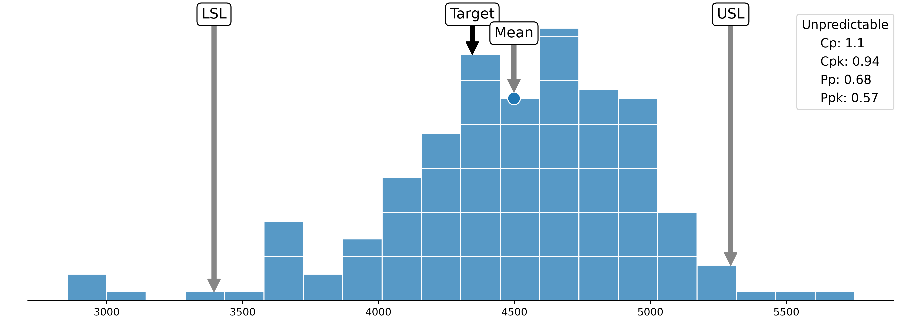
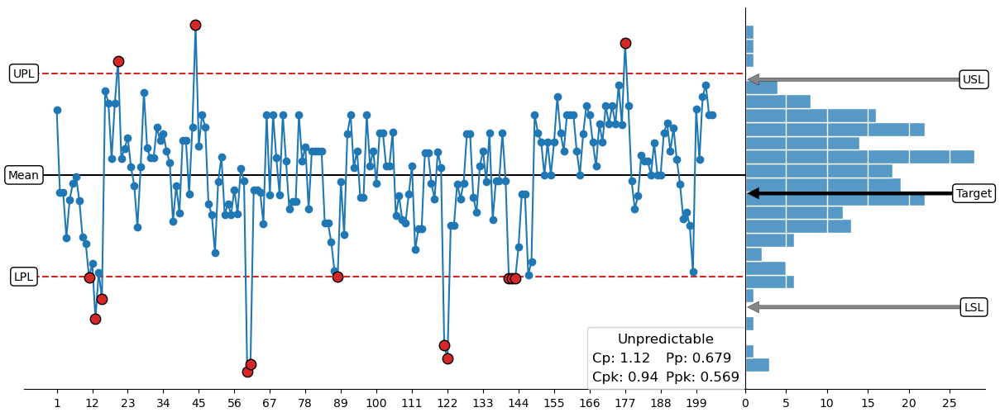
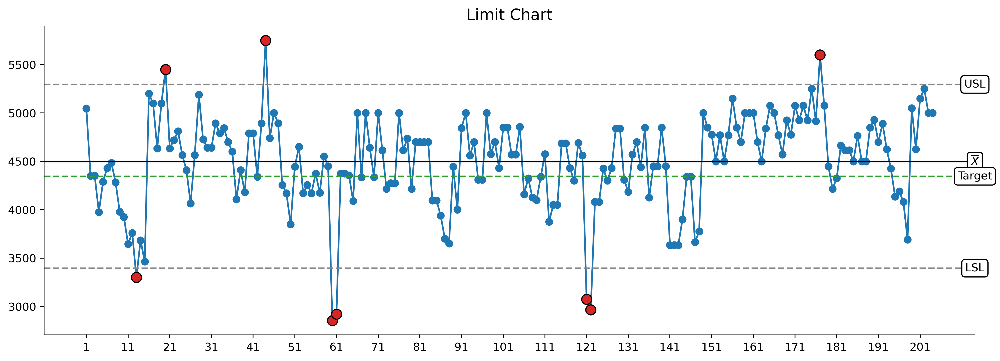
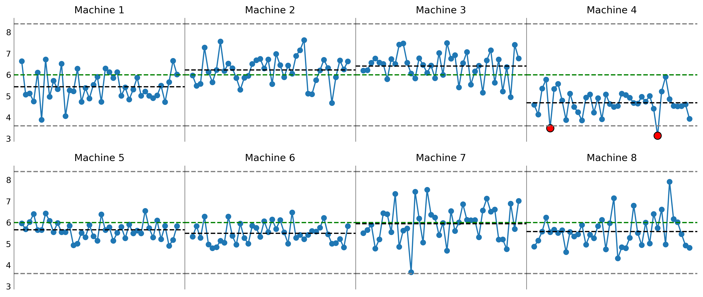
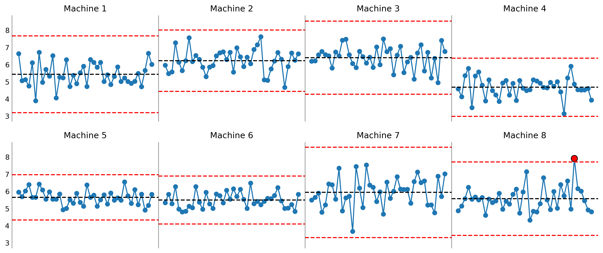
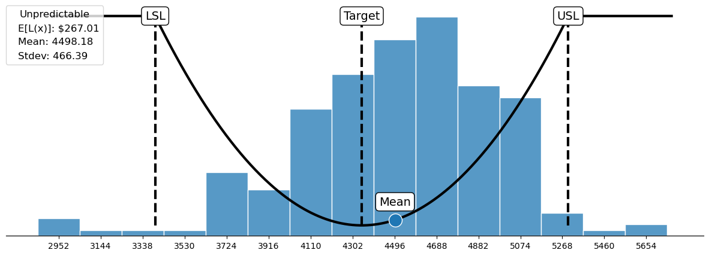
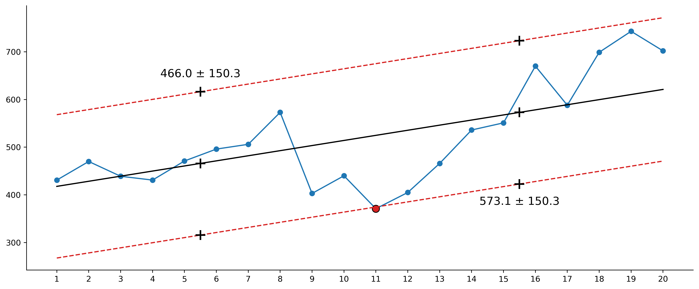
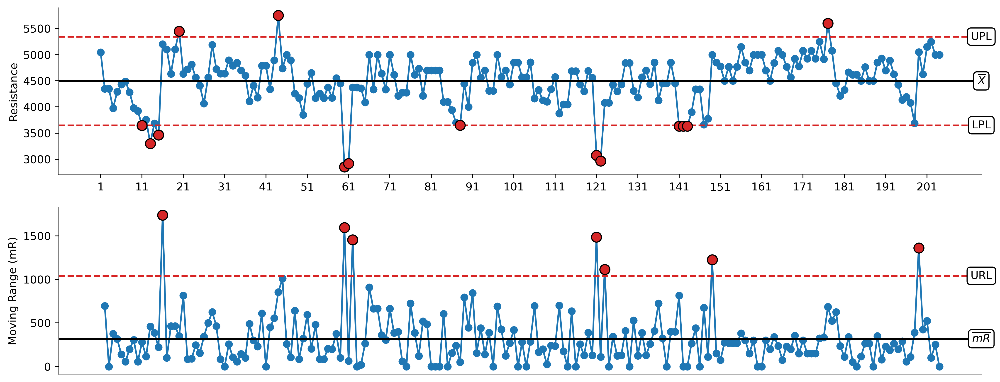
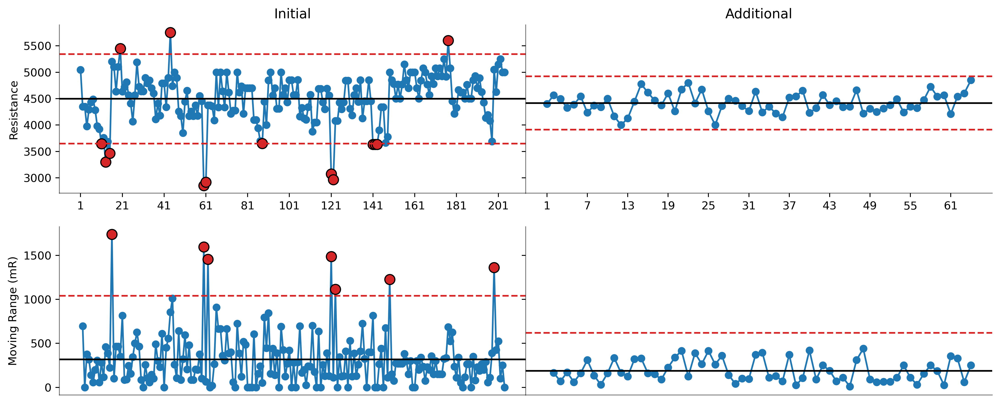

# process_improvement

[](https://pypi.org/project/process-improvement/)
[]
[](https://github.com/jimlehner/process-improvement/blob/main/LICENSE)

A Python library for performing calculations and generating figures that facilitate an understanding of process **variation**.

The primary tool of this library is the **XmR chart**. It also generates grids of X charts (called **network analysis**), capability histograms, Taguchi loss functions, limit charts, and grids of limit charts (called **limit chart network analysis**).

Calculations for process limits are based on the work of **Walter A. Shewhart** and **Donald J. Wheeler**. For those unfamiliar with Wheeler's work, visit [SPCpress.com](https://www.spcpress.com).

The intent of this library is to provide a practical alternative to subscription-based software packages like **Minitab** and **JMP**.

It is part of a broader project called **The Broken Quality Initiative**, which aims to provide manufacturing, process, and quality engineers with the tools and knowledge required to reduce costs and improve quality.

To learn more about the project, visit [BrokenQuality.com](https://brokenquality.com).

## Table of Contents
- [Installation](#installation)
- [Features](#features)
- [Quick Start](#quick-start)
- [Function Descriptions and Examples](#function-descriptions-and-examples)
    - [Capability Histogram](#capability-histogram)
    - [Combo Chart](#combo-chart)
    - [Limit Chart](#limit-chart)
    - [Limit Chart Network Analysis](#limit-chart-network-analysis)
    - [Network Analysis](#network-analysis)
    - [Taguchi Loss Function](#taguchi-loss-function)
    - [XmR Chart](#xmr-chart)
    - [XmR Chart Comparison](#xmr-chart-comparison)
- [Configuration and usage](#configuration-and-usage)
- [Project Structure](#project-structure)
- [Contributing](#contributing)
- [Additional Reading](#additional-reading)
- [License](#license)

## Installation

Install via pip:
```bash
pip install process-improvement
```

Or clone the repository for development:
```bash
git clone https://github.com/jimlehner/process_improvement.git
cd process-improvement
pip install -e .
```

## Features
- Generate XmR charts (Individuals and Moving Range)
- Calculates average moving range (mR̄) and process limits
- Generates comparison XmR charts
- Generates capability histogram and calculates the process capability indices (Cp, Cpk, Pp, Ppk)
- Generates Taguchi Loss Function visualization to understand economic loss due to poor quality
- Generates limit charts
- Generates a grid of XmR charts (network analysis)
- Generates a grid of run charts with specification limits (limit chart network analysis)
- Support for custom chart configuration (size, dpi, colors) 
- Generates publication-quality charts using Matplotlib/Seaborn
- Modular architecture for extending charts, configurations, and workflows

## Quick Start

```python
import pandas as pd
from process_improvement.charts.xmr_charts import xmr_chart
from process_improvement.charts.utils import XmRChartConfig

# Sample process data
df = pd.DataFrame({
    "date": ["2025-01-01", "2025-01-02", "2025-01-03", "2025-01-04"],
    "value": [5.2, 5.5, 5.1, 5.8]
})

# Configure the chart
config = XmRChartConfig(
    show=True,             # Display chart immediately
    limit_chart_ylabel="Resistance",
    show_label_values=True,
    show_mean=True
)

# Generate XmR chart
xmr_result = xmr_chart(
    df=df,
    values="value",
    x_labels="date",
    config=config
)
```

## Function Descriptions and Examples

Example figures and descriptions for each chart in this library.

### Capability Histogram

The `capability_histogram` function plots a histogram of process data in the context of the Upper Specification Limit (USL), Lower Specification Limit (LSL), target, and mean. This enables an understanding of process behavior in the context of the **voice of the customer**. 

The function also calculates the process capability indices: the capability ratio (Cp), the centered capability ratio (Cpk), the performance ratio (Pp), and the centered performance ratio (Ppk). To learn more about these indices visit [BrokenQuality.com/process-capability-indices](https://www.brokenquality.com/process-capability-indices).



### Combo Chart

The `combo_chart` function displays the X chart portion of an XmR chart with a horizontally oriented histogram. The shared y-axis between the subplots allows for direct visual comparison between the voice of the process, defined by the Upper Process Limit (UPL) and the Lower Process Limit (LPL), compared with the voice of the customer, defined by the Upper Specification Limit (USL) and the Lower Specification Limit (LSL).  



### Limit Chart

The `limit_chart` function plots a time series or running record of process data with the additional context of the Upper Specification Limit (USL), Lower Specification Limit (LSL), target, and process mean. This allows users to contextualize how a process has changed over time with respect to the voice of the customer (i.e., the specification limits). Values that fall outside of the specification limits are colored red.



### Limit Chart Network Analysis

The `limit_chart_network_analysis` function plots a grid of time series or running records that contain process data from multiple system elements performing the same task. Like the `limit_chart` function, each subplot in the grid displays the Upper Specification Limit (USL), Lower Specification Limit (LSL), target, and mean in each subplot. This allows users to compare how different elements performing the same task are operating with respect to each other and with respect to the voice of the customer (i.e., the specification limits).



### Network Analysis

The `network_analysis` function plots a grid of X charts containing process data from multiple elements performing the same task and using the same performance or quality metric. Like the `xmr_chart` function, each subplot in the grid displays the associated Upper Process Limit (UPL), Lower Process Limit (LPL), and process mean. This allows users to compare how different elements performing the same task are operating with respect to each other and with respect to the voice of the process (i.e., the process limits).



### Taguchi Loss Function

The `taguchi_loss_function` function plots the quadratic loss function called the Taguchi loss function with respect to the specified Upper Specification Limit (USL), Lower Specification Limit (LSL), target and process mean. The vertex of the parabola sits at the target value. The further the mean deviates from the target, the larger the loss due to poor quality. 

Loss increases quadratically until the function reaches the specification limits. Here, the maximum loss due to poor quality is incurred. In instances where rework can be performed, a portion of the loss can be recovered.

The `taguchi_loss_function` function allows users to optionally display process data as a histogram. 



### Trend X Chart

The `trend_xchart` function generates an X chart of process data that appears to be is increasing or decreasing over time.

When all of the values fall inside the trended process limits, the underlying causal system is characterized as **predictable**. The future behavior of a predictable process can be anticipated within limits 
because only common causes of routine variation influence process behavior. 

When one or more values fall outside the process limits, the underlying causal system is characterized as **unpredictable**. The future behavior of an unpredictable process **cannot** be predicted within limits because both common causes of routine variation and assignable causes of exceptional variation influence process behavior.



### XmR Chart

The `xmr_chart` function generates an XmR chart of process data. The XmR chart is composed of two figures: the X chart and the mR chart. 

The X chart plots logically comparable individual values. It includes the Upper Process Limit (UPL), Lower Process Limit (LPL), and process mean. The mR chart plots the moving ranges associated with the logically comparable individual values along with the Upper Range Limit (URL) and the average moving range.

When all of the values fall inside the process limits, the underlying causal system is characterized as **predictable**. The future behavior of a predictable process can be anticipated within limits because only common causes of routine variation influence process behavior. To improve a predictable process, new technology, equipment, materials, methods, or procedures must be introduced.

When one or more values fall outside the process limits, the underlying causal system is characterized as **unpredictable**. The future behavior of an unpredictable process **cannot** be predicted within limits because both common causes of routine variation and assignable causes of exceptional variation influence process behavior. To improve a predictable process, the assignable causes must be understood and eliminated.



### XmR Chart Comparison

The `xmr_comparison` function generates a grid of XmR charts that contain process data from different process steps or stages. This function helps users evaluate how a process has changed over time.



## Configuration and Usage

Configuration and usage details for each function can be found in [USAGE.md](USAGE.md)

## Project Structure

The library project structure is as follows:

```
process_improvement/         
├── pyproject.toml
├── README.md
├── LICENSE
├── MANIFEST.in
├── .github/
│   └── workflows/
│       └── ci.yml
├── tests/
│   ├── test_figures/
│   ├── test_capability_histogram.py
│   ├── test_network_analysis.py
│   ├── test_xmr_chart.py
│   └── test_xmr_comparison.py
├── docs/
│   ├── USAGE.md
│   ├── figures/
│   │   ├── capability_histogram_example.png
│   │   ├── combo_chart_example.png
│   │   ├── limit_chart_example.png
│   │   ├── limit_chart_network_analysis_example.png
│   │   ├── network_analysis_example.png
│   │   ├── taguchi_loss_function_example.png
│   │   ├── xmr_chart_example.png
│   │   └── xmr_comparison_example.png
│   └── notebooks/
│       ├── capability_histogram_demo.ipynb
│       ├── combo_chart_demo.ipynb
│       ├── limit_chart_demo.ipynb
│       ├── limit_chart_network_analysis_demo.ipynb
│       ├── network_analysis_demo.ipynb
│       ├── taguchi_loss_function_demo.ipynb
|       ├── trended_xchart_demo.ipynb
│       ├── xmr_chart_demo.ipynb
│       └── xmr_comparison_demo.ipynb
└── process_improvement/
    ├── __init__.py
    ├── __main__.py
    ├── cli.py
    ├── data_loader.py
    ├── charts/
    │   ├── capability_histogram.py
    │   ├── combo_chart.py
    │   ├── limit_charts.py
    │   ├── results.py
    │   ├── taguchi_loss.py
    │   ├── utils.py
    │   └── xmr_charts.py
    ├── calculations/
    │   ├── capability_calculations.py
    │   ├── loss_function_calculations.py
    │   └── xmr_calculations.py
    └── data/
        ├── 2170_battery_cells.csv
        ├── 18650_battery_cells.csv
        ├── automated_manufacturing_part_lengths.csv
        ├── eight_machine_manufacturing_process.csv
        ├── milikans_electron_charge_observations.csv
        ├── monthly_united_states_trade_deficits_2024.csv
        ├── OP200_weekly_first_pass_yield.csv
        ├── quarterly_sales_by_region.csv
        ├── shewharts_resistance_measurements.csv
        ├── software_verification_death_to_birth_rates.csv
        ├── software_verification_resistance_measurements.csv
        └── wafer_assembly_part_placement.csv
```

## Contributing

Contributions to this project are welcome! To ensure the process is smooth, please follow these guidelines:

### 1. Set up your development environment
```bash
# Clone the repository
git clone https://github.com/jimlehner/process-improvement.git
cd process-improvement

# Install dependencies for development
pip install -e .[dev]
```

### 2. Code style
- Follow [PEP8](https://peps.python.org/pep-0008/) standards.
- Use [Black](https://black.readthedocs.io/en/stable/) for automatic formatting.

### 3. Testing
- Add unit tests for new features or bug fixes.
- Run `pytest` before submitting pull requests: pytest tests/ -- cov

### 4. Pull requests
- Create a descriptive branch (e.g., feature/add-xmr-chart).
- Submit a PR with a clear description and reference relevant issues.

### 5. Reporting issues
- Open issues for bugs or feature requests with steps to reproduce and examples.

## Additional Reading
- [BrokenQuality.com](https://www.brokenquality.com/)
- [SPC Press Reading Room](https://www.spcpress.com/reading_room.php)
- [Walter Shewhart's book Economic Control of Quality of Manufactured Product](https://archive.org/details/economiccontrolo0000shew)

## License

MIT License. See LICENSE file for details.
